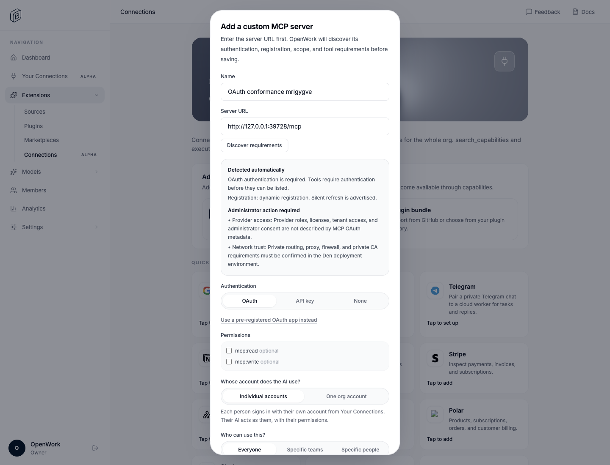
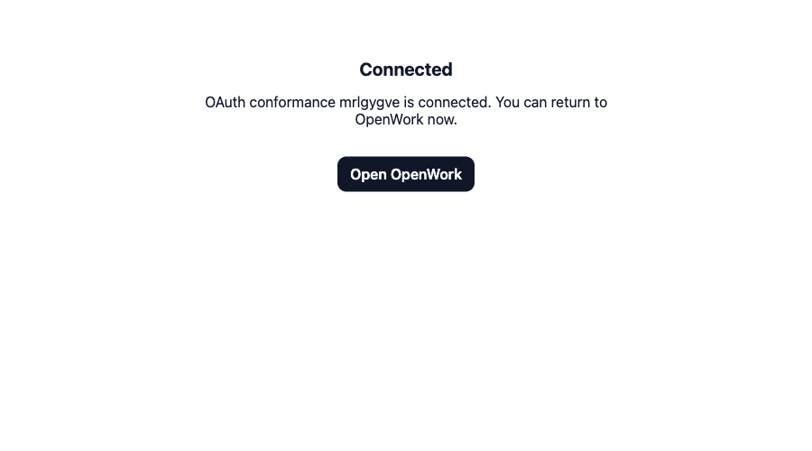
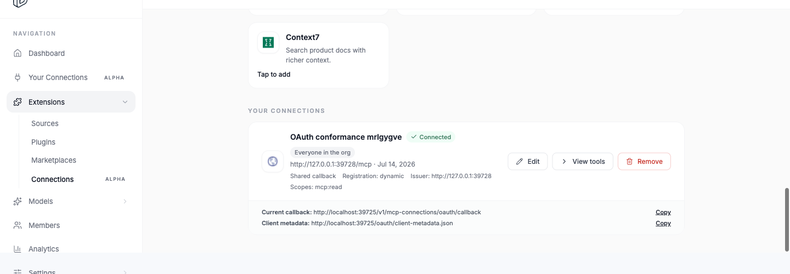
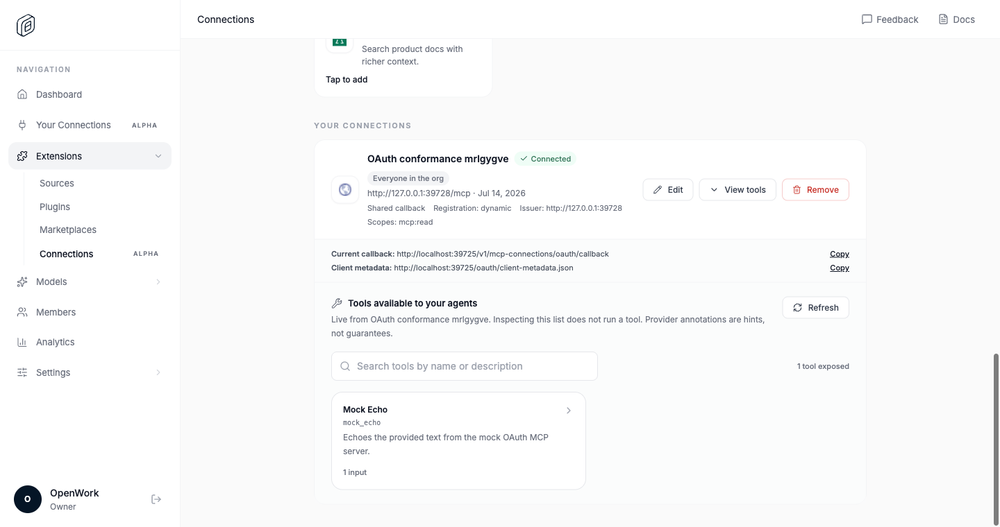

# MCP OAuth conformance proof

These frames were captured by the `mcp-oauth-conformance` Fraimz flow on
July 14, 2026 (America/Los_Angeles). The flow uses an isolated Den database and
OpenWork's local OAuth MCP conformance server; it does not use a third-party
service or pre-seeded connection.

The passing journey proves that:

1. URL-only requirements discovery reports OAuth, registration, scope, and
   administrator requirements without creating a connection or registering a
   client.
2. DCR identifies OpenWork as a web client, PKCE authorization completes, and
   the provider returns through the deployment-wide callback.
3. The normalized connection contract reports a connected dynamic client with
   the shared callback and selected scope.
4. The authorized tool is visible in the dashboard and works through
   `search_capabilities` and `execute_capability`.
5. At a 600px-tall viewport, the add-connection dialog remains fully bounded,
   switches to internal scrolling, and keeps the final action reachable. The
   run measured a 550px client height, 745px scroll height, `overflow-y: auto`,
   and dialog bounds from 24px to 576px.

The machine-readable assertions and voice-over coverage are recorded in
[report.md](./report.md). The durable end-to-end flow lives in
`evals/flows/mcp-oauth-conformance.flow.mjs`.

## Frames

